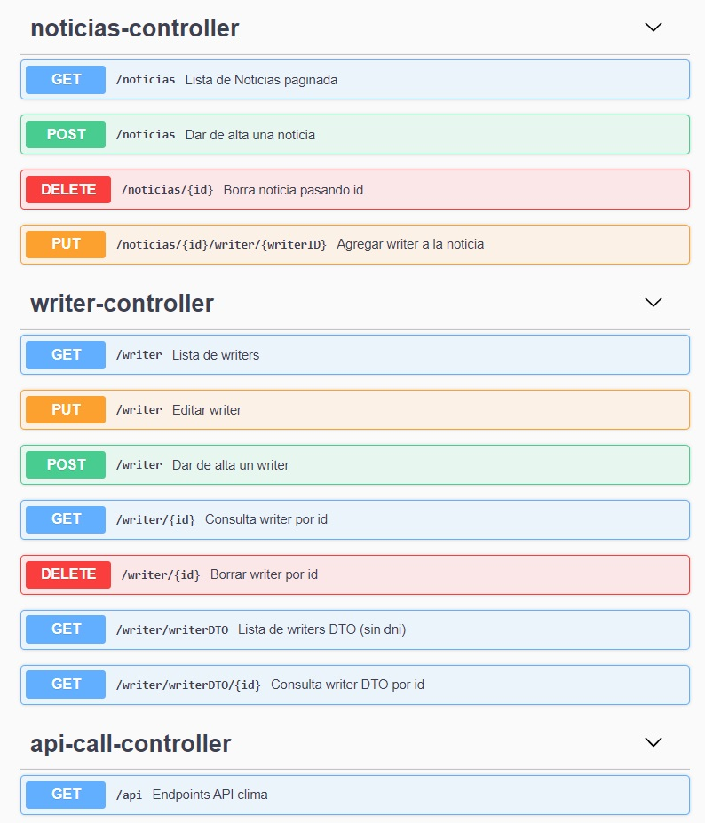
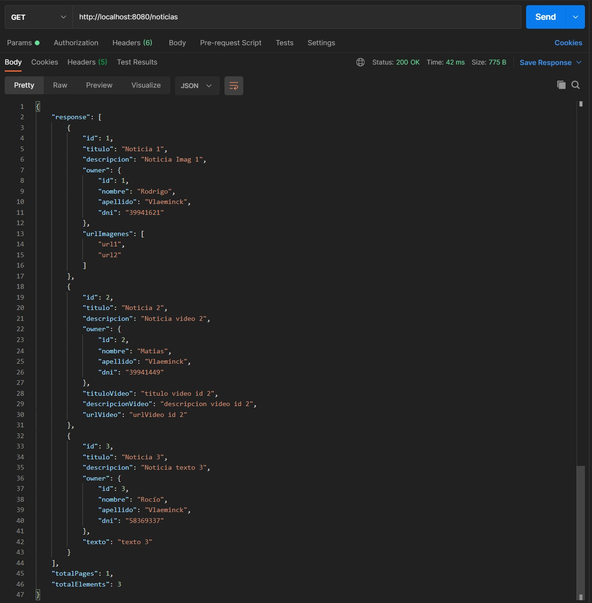
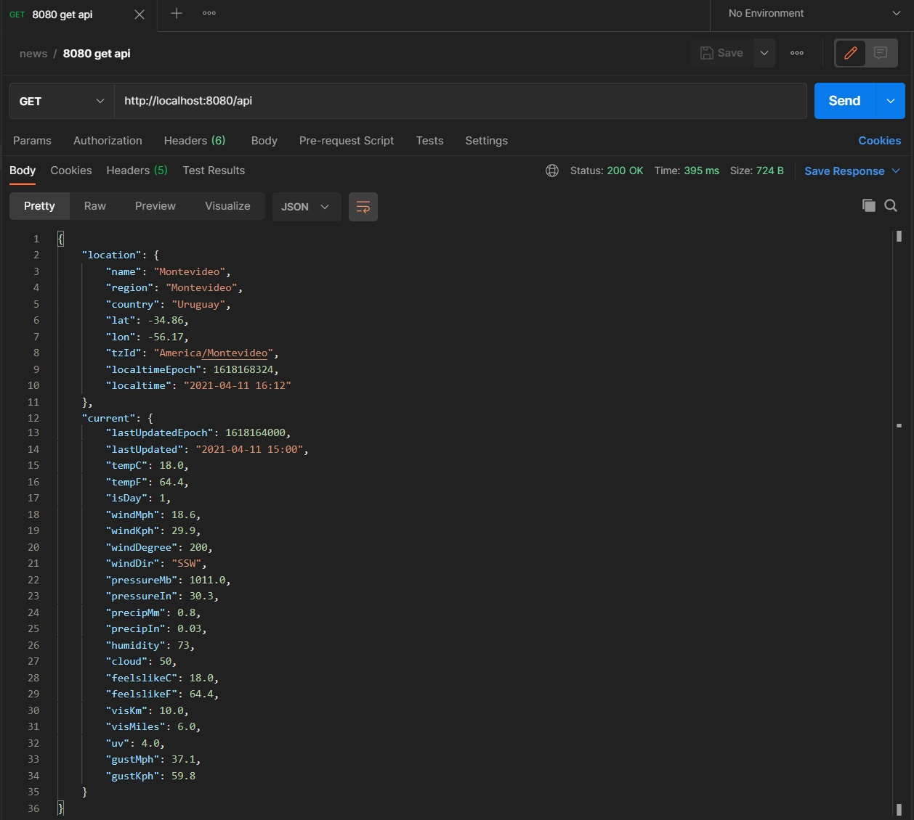
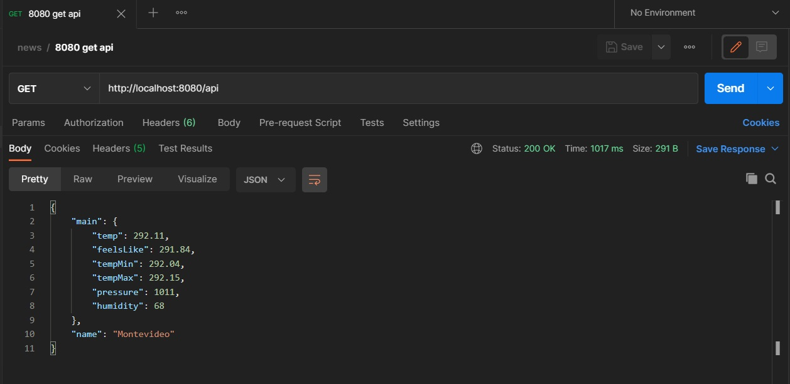
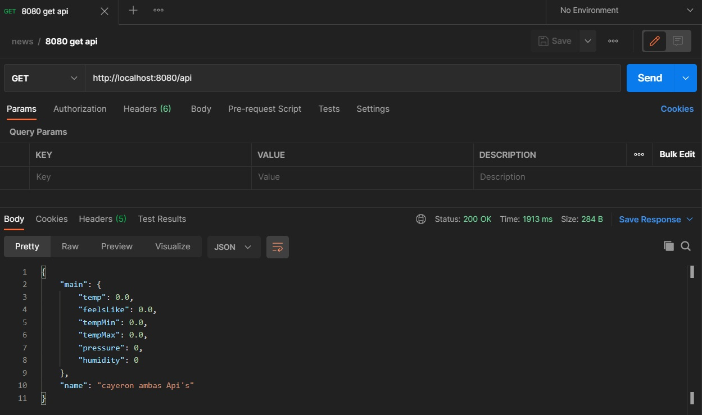
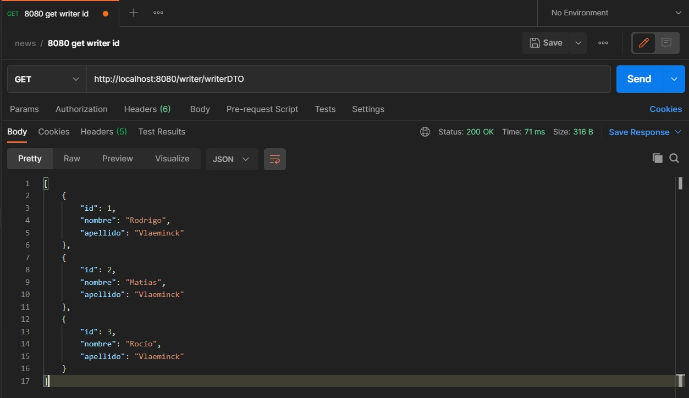

# Java-Spring-HenryNews

Tareas:

- Crear una clase padre Noticias abstract con titulo y descripcion y un owner del tipo Writer. Los hijos son NoticiasVideo, NoticiasImagenes y NoticiasTexto. Video tiene título, descripcion y url video, imágenes una lista de urls de imag y texto un string con texto.
- Crear una clase Writer con nombre, apellido y dni.
- Llamar a una api de clima, llamado con fallback y llamar a una segunda api
- DTO para el writer que no muestre algun campo.

### Our stack of technologies:

- Back End:

  - Spring
    - Dependencies :
      - Spring web
      - Data JPA
      - H2 Database
      - Lombok
      - MySQl connector
      - Swagger (springdoc: openapi-ui y openapi-webmvc-core)
      - GSON
      - Circuit Breaker (resilience4j)
      - DTO (modelmapper)

- Docker-compose.yml (levanta MySQL)

- Database:

  - MySQL

- Endpoints:
  - Swagger

# Previews

### Endpoints:

### Get All Noticias (with pagination):

### Call Weather API 1:

### Call Weather API 2:

### Two API's fail:

### Writer DTO:

